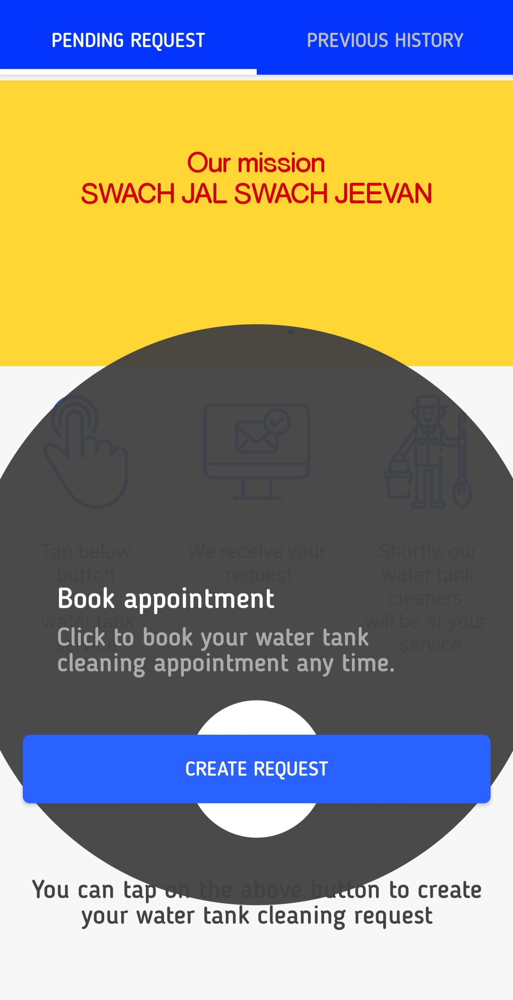

# WaterWare
Here I attempted to make a water reservoir cleaning system using android with java and libraries. This application is connected to two other apps which handle the cleaning request made by the user.

||||

Other two apps link:

https://github.com/ShivamPrajapati-dev/AdminWaterWare.git

https://github.com/ShivamPrajapati-dev/WaterWareConnect.git
